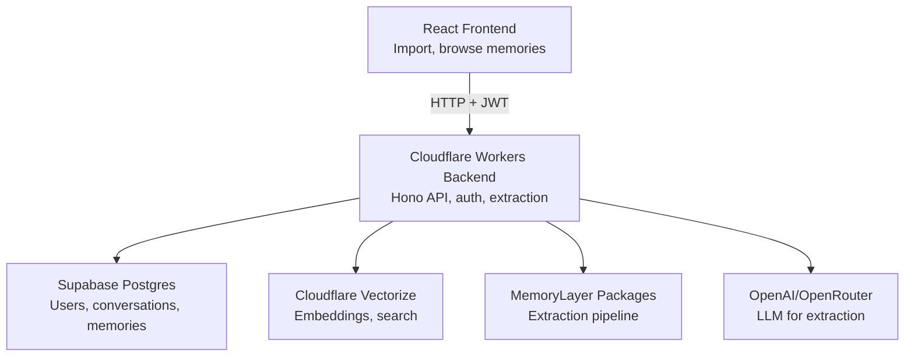

# Handoff

**A MemoryLayer-powered app that transforms raw AI chat history into structured, reusable memories you can carry between models.**

Handoff imports your conversations from ChatGPT and other AI providers, extracts a structured knowledge graph, and lets you reuse that context anywhere—through an in-app assistant or concise context blocks you can paste into any LLM.

- 📥 **Import**: Bring conversations from ChatGPT (via official export) into your own database
- 🧠 **Extract**: MemoryLayer builds structured entities, facts, and decisions from raw chats
- 🔄 **Reuse**: Query memories in-app or generate smart context blocks for any LLM
- 🔒 **Privacy**: Your data stays in your own Supabase database, ToS-compliant
- ✅ **MAKER**: Multi-agent consensus for high-confidence extraction

**Use Cases**: Context portability between models • Knowledge management • Decision tracking • Semantic search over past conversations • Team handoffs without full transcripts

---

## What Makes Handoff Different

### 1. Import-First, ToS-Friendly
- No browser scraping or automation
- Works with official export flows (e.g., ChatGPT's `conversations.json`)
- Completely compliant with provider terms of service
- Your data stays in your own database

### 2. MemoryLayer, Not Just Logs
Conversations are stored, but the focus is on **structured memories**:
- **Entities**: "Phishing Indicators", "React migration plan"
- **Decisions**: "We chose Postgres for analytics"
- **Facts and metrics**: Timestamped, sourced, confidence-scored

Extraction powered by:
- Configurable LLM (e.g., Claude Haiku 4.5)
- Cloudflare Vectorize for embeddings and semantic search
- **MAKER reliability layer** for high-confidence extraction

### 3. MAKER Reliability Layer

For critical session summaries, Handoff uses a **MAKER-inspired consensus system**:

- **Microagents**: 3 parallel LLM calls extract summaries, decisions, and todos
- **Red-Flagging**: Validates outputs against strict schemas to filter hallucinations
- **Voting**: K-threshold consensus selects the most accurate extraction

MAKER-verified memories are marked with `maker_verified: true` and higher confidence scores (0.95 vs standard 0.6-0.7), ensuring your critical project context is robust and consistent.

**Configuration** (environment variables):
```bash
MAKER_ENABLED=true          # Enable/disable MAKER (default: true)
MAKER_REPLICAS=3            # Number of parallel agents (default: 3)  
MAKER_TEMPERATURE=0.4       # LLM temperature for consistency (default: 0.4)
```

### 4. Smart, Concise Handoffs

The `/api/handoff/export` endpoint builds **short, opinionated context blocks**:
- Infers a one-line `Task:` from the last user message
- Summarizes recent turns into a compact "Recent:" line
- Ranks the most relevant memories as **Key facts** with source + time + confidence

**Example output:**
```text
Context for LLM
- Task: design a phishing detection training module
- Recent: User asked how to categorize phishing indicators | Assistant proposed pillars
- Key facts:
  1) Phishing Indicators: signs like suspicious links and urgent language | type: entity | source: Phishing Indicators | 1d ago | conf: 95%
  2) User Detection Rates: % of users who spot phishing attempts | type: entity | source: Metrics note | 1d ago | conf: 92%
```

Not a wall of transcripts—just the distilled context another model actually needs.

### 5. Single-User by Design

Optimized for **one user, one workspace**:
- Less complexity, no admin dashboards or deep RBAC
- Easier to reason about extraction costs
- Still uses MemoryLayer's multi-workspace schema for extensibility

You can add more workspaces later (e.g., "work" vs "personal") or evolve into a team product if needed.

---

## Architecture

### Tech Stack

**Backend** ([`backend/`](./backend))
- **Runtime**: Cloudflare Workers (via Wrangler)
- **Framework**: Hono (HTTP routing + middleware)
- **Database**: Supabase Postgres (with RLS + JWT auth)
- **Vector/Embeddings**: Cloudflare Vectorize
- **MemoryLayer**: Structured extraction + storage
- **Auth**: JWT-based, backed by Supabase `users` table

**Frontend** ([`frontend/`](./frontend))
- **Framework**: React 18 + TypeScript + Vite
- **Styling**: Tailwind CSS
- **UI Components**: Headless UI
- **Routing**: React Router
- **State Management**: TanStack Query

### System Overview



The backend does three main things:
1. Validates auth via JWT
2. Calls Supabase via parameterized SQL
3. Orchestrates MemoryLayer extraction and formats responses

---

## Getting Started

### Prerequisites

- Node.js 18+ and npm
- Supabase account (free tier works)
- Cloudflare account (for Workers and Vectorize)
- OpenAI API key or OpenRouter account

### Installation

```bash
# Clone the repository (if not already in frankenstein monorepo)
git clone <repository-url>
cd frankenstein/apps/handoff

# Install dependencies from monorepo root
cd ../..
npm install
```

### Backend Setup

1. **Create Supabase Project**
   - Sign up at [supabase.com](https://supabase.com)
   - Create a new project
   - Note your project URL and anon key

2. **Run Database Migrations**
   ```bash
   cd apps/handoff/backend
   ```
   - Open Supabase SQL Editor
   - Run [`SETUP_DATABASE.sql`](./backend/SETUP_DATABASE.sql)
   - Run [`migrations/004_chat_conversations.sql`](./backend/migrations/004_chat_conversations.sql)
   - Enable `vector` extension, then run [`migrations/005_semantic_search.sql`](./backend/migrations/005_semantic_search.sql)

3. **Configure Environment Variables**
   
   Create `apps/handoff/backend/.dev.vars`:
   ```bash
   SUPABASE_URL=https://your-project.supabase.co
   SUPABASE_KEY=your-supabase-anon-key
   JWT_SECRET=your-jwt-secret-min-32-chars
   
   # OpenAI or OpenRouter for extraction
   OPENAI_API_KEY=your-openai-key
   # OR
   OPENROUTER_API_KEY=your-openrouter-key
   
   # MAKER configuration (optional, defaults shown)
   MAKER_ENABLED=true
   MAKER_REPLICAS=3
   MAKER_TEMPERATURE=0.4
   MAKER_MODEL=gemini-2.0-flash-lite
   ```

4. **Set Up Cloudflare Vectorize**
   ```bash
   # Create a Vectorize index
   wrangler vectorize create handoff-memories --dimensions=1536 --metric=cosine
   
   # Update wrangler.toml with your index name
   ```

5. **Start Backend Dev Server**
   ```bash
   npm run dev
   # Runs on http://localhost:8787
   ```

### Frontend Setup

1. **Configure Environment Variables**
   
   Create `apps/handoff/frontend/.env`:
   ```bash
   VITE_API_URL=http://localhost:8787
   ```

2. **Start Frontend Dev Server**
   ```bash
   cd apps/handoff/frontend
   npm run dev
   # Runs on http://localhost:5173
   ```

### First Use

1. Open http://localhost:5173
2. Sign up for an account
3. Create a workspace
4. Import a ChatGPT export (`conversations.json`)
5. Browse memories and generate handoff contexts!

---

## API Documentation

### Authentication
- `POST /api/auth/signup` – Create new user account (email/password)
- `POST /api/auth/login` – Login, returns JWT
- `GET /api/auth/me` – Get current user info

### Workspaces
- `GET /api/workspaces` – List user's workspaces
- `POST /api/workspaces` – Create workspace (`personal` or `team`)
- `POST /api/workspaces/:id/members` – Add member by email
- `GET /api/workspaces/:id/members` – List members
- `DELETE /api/workspaces/:id` – Delete workspace (owner only)

### Conversations
- `GET /api/conversations` – List conversations (with paging/search)
- `GET /api/conversations/:id` – Conversation detail (messages + metadata)

### Memories
- `GET /api/memories` – List/search memories (type/date/search filters)
- `GET /api/memories/:id` – Single memory detail with attribution

### Import/Export
- `POST /api/import` – Import conversation JSON (ChatGPT export)
- `GET /api/handoff/export` – Generate concise context block for LLM

See detailed API docs:
- [Import API Documentation](./backend/IMPORT_API.md)
- [Export API Documentation](./backend/EXPORT_API.md)
- [Authentication Documentation](./backend/AUTH_README.md)

---

## Testing

### Backend Tests

```bash
cd apps/handoff/backend

# Run all tests
npm test

# Run with watch mode
npm run test:watch

# Run with coverage
npm run test:coverage

# Run only unit tests
npm run test:unit

# Run only integration tests
npm run test:integration
```

### Frontend Tests

```bash
cd apps/handoff/frontend

# Run all tests
npm test

# Run with watch mode
npm run test:watch
```

---

## Deployment

### Backend (Cloudflare Workers)

```bash
cd apps/handoff/backend

# Set production secrets
wrangler secret put SUPABASE_URL
wrangler secret put SUPABASE_KEY
wrangler secret put JWT_SECRET
wrangler secret put OPENAI_API_KEY

# Deploy
npm run deploy
```

### Frontend (Cloudflare Pages)

```bash
cd apps/handoff/frontend

# Build
npm run build

# Deploy
npm run deploy
```

Or set up automatic deployments via Cloudflare Pages dashboard connected to your Git repository.

---

## Database Schema

### Core Tables

- **`users`** – User accounts with hashed passwords
- **`workspaces`** – User workspaces (personal/team)
- **`workspace_members`** – Team membership and roles
- **`conversations`** – Chat conversations with metadata
- **`messages`** – Conversation messages with roles
- **`memories`** – Extracted structured knowledge
- **`relationships`** – Memory-to-memory relationships

### Special Features

- **Row-Level Security (RLS)**: Enforces workspace-scoped access at the database level
- **JWT Auth**: Supabase JWT claims validate user identity
- **Vector Search**: Semantic search via embeddings stored in Cloudflare Vectorize
- **MAKER Verification**: High-confidence memories marked with `maker_verified: true`

See [`backend/SETUP_DATABASE.sql`](./backend/SETUP_DATABASE.sql) for full schema.

---

## Development Workflow

### Monorepo Structure

```
frankenstein/
├── apps/
│   └── handoff/
│       ├── backend/          ← Cloudflare Workers API
│       └── frontend/         ← React + Vite frontend
└── packages/
    └── core/
        ├── chat-capture/
        ├── memory-extraction/
        ├── storage/
        └── context-engine/
```

### Working with MemoryLayer Packages

Handoff uses local MemoryLayer packages via `file:` references in `package.json`. Changes to MemoryLayer are immediately reflected in Handoff.

```bash
# Make changes to a MemoryLayer package
cd packages/core/memory-extraction

# Rebuild TypeScript
npm run build

# Handoff backend automatically picks up changes
cd ../../../apps/handoff/backend
npm run dev
```

### Code Style

- **Backend**: TypeScript with Hono framework patterns
- **Frontend**: React functional components + hooks, Tailwind for styling
- **Tests**: Vitest for both backend and frontend
- **Linting**: ESLint with TypeScript rules

---

## Environment Variables Reference

### Backend (`.dev.vars`)

| Variable | Description | Example |
|----------|-------------|---------|
| `SUPABASE_URL` | Supabase project URL | `https://xxx.supabase.co` |
| `SUPABASE_KEY` | Supabase anon key | `eyJhbGc...` |
| `JWT_SECRET` | JWT signing secret (32+ chars) | `your-secret-here` |
| `OPENAI_API_KEY` | OpenAI API key (optional) | `sk-...` |
| `OPENROUTER_API_KEY` | OpenRouter API key (optional) | `sk-or-...` |
| `MAKER_ENABLED` | Enable MAKER reliability layer | `true` |
| `MAKER_REPLICAS` | Number of parallel agents | `3` |
| `MAKER_TEMPERATURE` | LLM temperature | `0.4` |
| `MAKER_MODEL` | Model for extraction | `gemini-2.0-flash-lite` |

### Frontend (`.env`)

| Variable | Description | Example |
|----------|-------------|---------|
| `VITE_API_URL` | Backend API URL | `http://localhost:8787` |

---

## Development Approach

Handoff was developed using Kiro's spec-driven development methodology:

### Spec-Driven Development with Kiro

The `.kiro/specs/app-handoff/` directory contains detailed specifications that guided the development:

- **requirements.md** - Feature requirements, user stories, and acceptance criteria for both personal and team workspaces
- **design.md** - Complete architecture including React components, Hono backend routes, MemoryLayer integration patterns
- **tasks.md** - Granular implementation task breakdown

### Development Process

1. **Spec Creation**: Specifications defined the complete system architecture:
   - Frontend component structure and state management
   - Backend API routes and service layer
   - MemoryLayer integration (extraction profiles, context building)
   - Database schema and workspace scoping

2. **AI-Assisted Implementation**: ~80% of initial implementation generated from specs using Kiro
   - Frontend: React components, routing, API client
   - Backend: Hono routes, service classes, MemoryLayer orchestration

3. **Manual Refinement**: Final implementation includes:
   - Comprehensive test suite (frontend + backend)
   - Production deployment configuration  
   - Database migrations and RLS policies
   - Error handling and edge case coverage

This approach enabled rapid prototyping of a full-stack application while maintaining clear separation of concerns and consistent APIs across frontend and backend.
## Contributing

Contributions welcome! Fork the repo, create a feature branch, and open a PR.

---

## License

MIT

---

See also: [Backend README](./backend/README.md) • [Frontend README](./frontend/README.md) • [MemoryLayer Core](../../packages/core/README.md)
