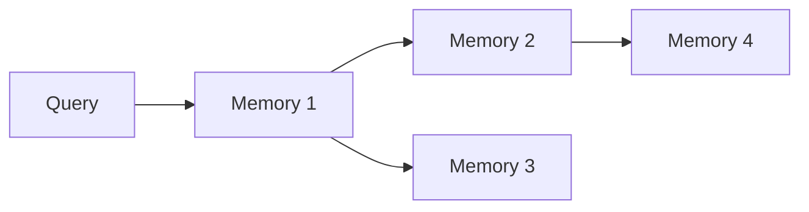

# @memorylayer/context-engine

Intelligent context building and semantic search engine for MemoryLayer - retrieve relevant memories using vector similarity and graph traversal.

## Features

- **Semantic Search**: Vector-based similarity search over memories
- **Relationship Traversal**: Graph-based context expansion
- **Smart Ranking**: Re-rank results by relevance and recency  
- **Token Budget**: Automatic context trimming to fit LLM limits
- **Template System**: Pre-built and custom context formatting
- **Type-Safe**: Full TypeScript support

## Installation

```bash
npm install @memorylayer/context-engine
```

## Quick Start

```typescript
import { ContextEngine } from '@memorylayer/context-engine';
import { StorageClient } from '@memorylayer/storage';
import { EmbeddingProvider } from '@memorylayer/embeddings';

const engine = new ContextEngine({
  storage: new StorageClient({...}),
  embedding: new EmbeddingProvider({...}),
});

// Build context for a query
const result = await engine.buildContext(
  "What files mention Project Alpha?",
  workspaceId,
  {
    limit: 10,
    includeRelationships: true,
    relationshipDepth: 2,
    tokenBudget: 2000,
    template: 'concise',
  }
);

if (result.ok) {
  console.log('Context:', result.value.context);
  console.log('Memories:', result.value.memories);
}
```

## Core Operations

### Build Context

```typescript
interface ContextOptions {
  limit?: number;              // Max memories to retrieve (default: 10)
  includeRelationships?: boolean;  // Traverse graph (default: false)
  relationshipDepth?: number;  // Graph traversal depth (default: 1)
  tokenBudget?: number;        // Max tokens for context (default: 1000)
  template?: string;           // Formatting template (default: 'default')
  types?: string[];            // Filter by memory types
  timeRange?: {
    from: Date;
    to: Date;
  };
}

const context = await engine.buildContext(query, workspaceId, options);
```

### Search Memories

```typescript
// Direct semantic search without formatting
const results = await engine.searchMemories(query, workspaceId, {
  limit: 20,
  types: ['entity', 'fact'],
  minScore: 0.7,
});

for (const result of results.value) {
  console.log(`${result.memory.content} (score: ${result.score})`);
}
```

### Fetch Related Memories

```typescript
// Get memories related to a specific memory
const related = await engine.fetchRelatedMemories(
  memoryId,
  workspaceId,
  {
    depth: 2,
    relationshipTypes: ['contains', 'related_to'],
  }
);
```

## Context Templates

Built-in templates for common use cases:

| Template | Description | Use Case |
|----------|-------------|----------|
| `concise` | Minimal formatting | Chat applications |
| `detailed` | Rich metadata | Analysis tools |
| `structured` | JSON format | API responses |
| `markdown` | Markdown formatted | Documentation |

### Custom Templates

```typescript
engine.registerTemplate('my-template', (memories, metadata) => {
  return `
# Context for ${metadata.query}

${memories.map(m => `- ${m.content}`).join('\n')}

---
Total: ${memories.length} memories
  `.trim();
});

const result = await engine.buildContext(query, workspaceId, {
  template: 'my-template',
});
```

## Ranking Algorithm

The context-engine uses a multi-factor ranking system:

1. **Semantic Similarity** (60% weight) - Vector cosimilarity score
2. **Recency** (20% weight) - Recent memories ranked higher
3. **Confidence** (10% weight) - Memory confidence scores
4. **Relationship Strength** (10% weight) - Graph connection strength

You can customize weights:

```typescript
const engine = new ContextEngine({
  storage,
  embedding,
  ranking: {
    similarity: 0.7,
    recency: 0.15,
    confidence: 0.1,
    relationships: 0.05,
  },
});
```

## Graph Traversal

Relationship-aware context building:



With `includeRelationships: true` and `relationshipDepth: 2`, the engine will:
1. Find semantically similar memories (M1)
2. Traverse relationships to M2 and M3
3. Continue to M4 if depth allows
4. Merge and re-rank all results

## Token Budget Management

The engine automatically trims context to fit token limits:

```typescript
const result = await engine.buildContext(query, workspaceId, {
  tokenBudget: 1500,  // Maximum tokens
  template: 'concise', // Use compact template
});

console.log('Token usage:', result.value.tokenCount);
console.log('Truncated:', result.value.truncated);
```

## Development

```bash
# Install dependencies
npm install

# Build
npm run build

# Run tests
npm test

#Watch mode
npm run test:watch
```

## Performance

- Vector search: ~10-50ms for 10K memories
- Graph traversal (depth=2): ~50-200ms
- Context building (complete): ~100-300ms

## License

MIT
